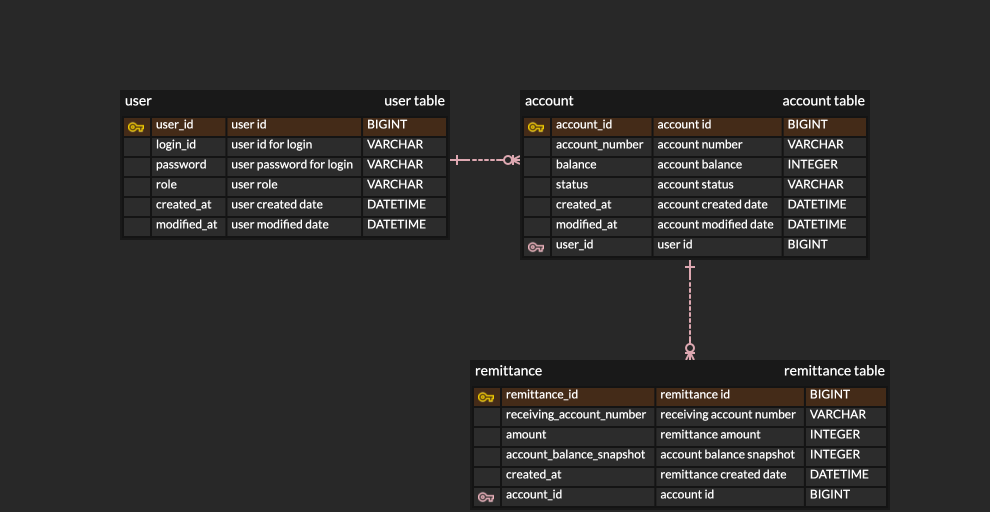

# 💸 CashFlow

간단한 계좌 입출금 및 송금 서비스입니다.

## Goal
  - Spring Boot 기반 REST API 설계
  - Spring Security를 이용한 인증과 인가 구현 (JWT)
  - Controller 및 Service 계층의 Unit 테스트

## Tech Stack

 
   
  
  
  
   

## 프로젝트 기능 및 설계
- 회원가입
  - 사용자는 회원가입을 할 수 있다.
  - 회원가입시 아이디와 패스워드를 입력받으며, 아이디는 unique 해야한다.
  - 일반적으로 모든 사용자는 회원가입시 USER 권한 (일반 권한)을 지닌다.
- 로그인
  - 사용자는 로그인을 할 수 있다.
  - 로그인시 아이디와 패스워드를 입력받으며, 이는 사용자 정보와 일치해야한다.
  - 로그인이 성공하면 인증 토큰이 발행된다.
 
- 계좌 생성
  - 로그인한 사용자는 계좌를 생성할 수 있다.
  - 계좌 생성시 계좌번호와 초기 잔액을 입력받는다.
  - 생성할 수 있는 계좌는 사용자마다 10개로 제한한다.
- 계좌 해지
  - 로그인한 사용자는 계좌를 해지할 수 있다.
  - 계좌 해지시 계좌 아이디를 입력받는다.
  - 해지된 계좌는 목록에서 조회될 수 있지만, 비활성 상태로 사용이 불가능하다.
- 계좌 삭제
  - 로그인한 사용자는 계좌를 삭제할 수 있다.
  - 계좌 삭제시 계좌 아이디를 입력받는다.
  - 삭제된 계좌는 더이상 목록에서 조회될 수 없다.
 
- 계좌 목록 조회
  - 로그인한 사용자는 자신이 가진 계좌 목록을 조회할 수 있다.
  - 계좌 목록은 생성일자를 기준으로 오름차순하여 먼저 생성된 계좌부터 조회되도록 한다.
  - 전체 계좌, 사용중인 계좌, 해지된 계좌로 필터링하여 조회할 수 있다.
  - 계좌들의 계좌번호, 잔액, 계좌상태가 목록으로 조회된다.
- 특정 계좌 조회
  - 로그인한 사용자는 자신이 가진 특정 계좌를 조회할 수 있다.
  - 특정 계좌 조회시 계좌 아이디를 입력받는다.
  - 특정 계좌의 계좌번호, 잔액, 계좌상태, 생성일자, 수정일자가 조회된다.
 
- 입금
  - 로그인한 사용자는 자신의 계좌에 입금할 수 있다.
  - 계좌 아이디와 금액을 입력받는다.
- 출금
  - 로그인한 사용자는 자신의 계좌에서 출금할 수 있다.
  - 계좌 아이디와 금액을 입력받는다.
  - 잔액은 출금하고자 하는 금액보다 커야한다.

- 송금
  - 로그인한 사용자는 자신의 계좌에서 다른 계좌로 송금할 수 있다.
  - 송금 계좌 아이디, 수금 계좌번호, 송금액을 입력받는다.
  - 송금 계좌의 잔액은 송금하고자 하는 금액보다 커야한다.
- 송금 내역 조회
  - 로그인한 사용자는 자신의 계좌의 송금 내역을 조회할 수 있다.
  - 송금 내역은 송금일자를 기준으로 내림차순하여 가장 최근 내역부터 조회되도록 한다.
  - 전체 송금 내역 또는 시작 날짜와 종료 날짜를 입력받아 해당 기간 내 송금 내역을 조회할 수 있다.
  - 수금 계좌번호, 송금액, 송금 완료 후 송금 계좌의 잔액, 송금일자가 목록으로 조회된다.

## ERD

